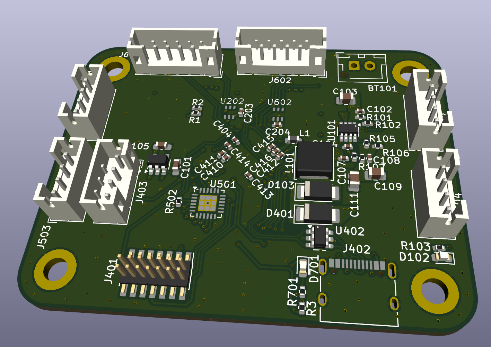
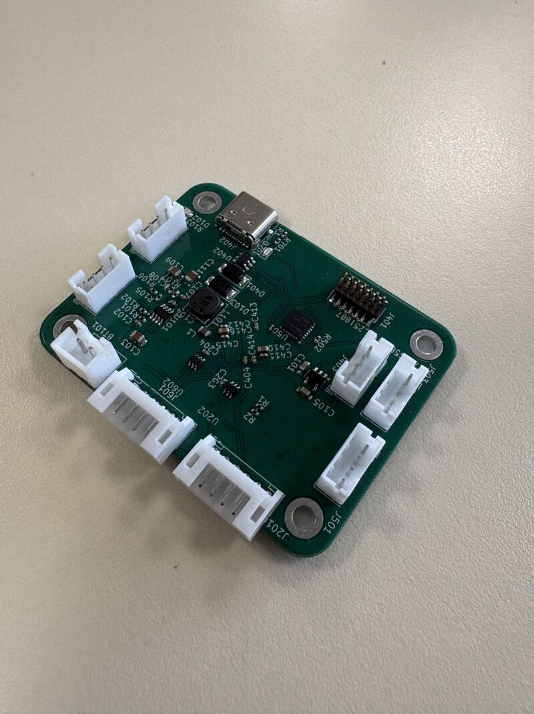
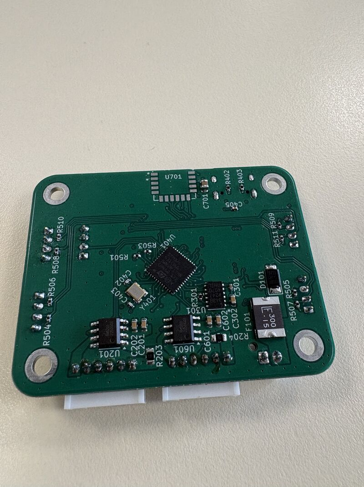
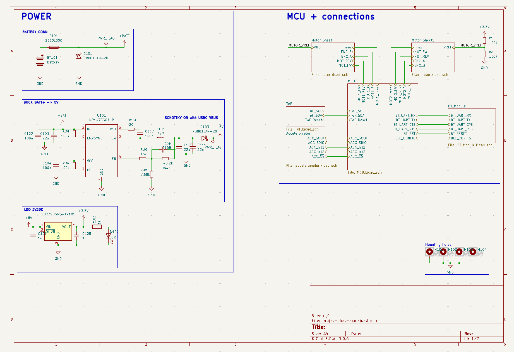

# 🤖 Robot Chat – Carte électronique de contrôle  
## Version alternative (non embarquée sur le robot final)

## Présentation générale

Ce dépôt présente une **carte électronique de contrôle** développée dans le cadre du projet **Robot Chat**, réalisé au sein de la spécialité **ESE**.

⚠️ **Note importante**  
Le PCB documenté ici correspond à une **version alternative de la carte électronique**, différente de celle effectivement intégrée sur le robot final.  
Cette version a été conçue afin d’explorer une **architecture plus modulaire et plus riche en périphériques**, tout en respectant les mêmes contraintes fonctionnelles et temporelles que la carte embarquée.

La carte a été **entièrement conçue, routée et préparée à la validation en 4 semaines**, couvrant l’ensemble de la chaîne électronique du système robotique.

---

## 🖼️ Vue d’ensemble du PCB

### Vue 3D
> *Implantation globale des composants et contraintes mécaniques*

### Faces Top & Bottom
> *Placement des composants, densité de routage et organisation des plans*

| Face Top | Face Bottom |
|---------|-------------|
|  |  |

📌 Ces visuels permettent une lecture rapide de la complexité de la carte et de sa qualité de conception.

---

## 🧠 Architecture système

### Schematic Globale
> *Vue haut niveau des sous-systèmes et des flux de données*

La carte est organisée autour des blocs fonctionnels suivants :
- calcul et traitement temps réel,
- commande des actionneurs,
- acquisition des capteurs,
- gestion de l’alimentation.

---

## 🔌 Calcul & communication

### Microcontrôleur principal

- **STM32G431 – 170 MHz**
  - Exécution de **FreeRTOS**
  - Gestion du contrôle moteur
  - Acquisition capteurs et fusion de données
  - Communication avec l’IHM PC (UART->Bluetooth)

Le microcontrôleur centralise les tâches temps réel critiques du système.

---

## ⚙️ Commande des moteurs

- **2 drivers de moteurs DC**
- Lecture des **codeurs incrémentaux**
- **Mesure de courant** pour :
  - estimation du couple,
  - détection de surintensité,
  - sécurisation du système

L’architecture permet un contrôle précis et robuste des actionneurs.

---

## 📡 Capteurs & navigation

- **4 capteurs Time-of-Flight (ToF)**
  - détection du vide,
  - évitement d’obstacles
- **IMU (accéléromètre + gyroscope)**
  - odométrie,
  - estimation de l’état du robot
- **Lidar**
  - cartographie de l’environnement,
  - navigation autonome dans l’aire de jeu

Le placement des capteurs a été pensé pour maximiser le champ de vision et limiter les interférences.

---

## 🔋 Architecture d’alimentation

### Arbre d’alimentation
> *Stratégie de régulation et domaines de tension*

- Plusieurs rails d’alimentation régulés
- Séparation des domaines :
  - puissance moteurs,
  - logique numérique,
  - capteurs sensibles
- Filtrage et découplage adaptés à un système embarqué mobile

---

## 🧱 Conception PCB

- **PCB 4 couches**
  - Signal
  - Plan de masse continu
  - Plan d’alimentation
  - Signal
- Séparation analogique / numérique
- Routage optimisé pour :
  - intégrité du signal,
  - réduction du bruit,
  - facilité de mise au point (bring-up)

---

## 👥 Équipe & encadrement

Projet réalisé par :
- Antoine Lemarignier  
- Louis Vozzola  
- Thomas Terlinden  
- Kenny Saint Fleur

Encadrement :
- **Laurent Fiack**
- **Nicolas Papazoglou**  
École nationale supérieure de l’Électronique et de ses Applications (ENSEA)

